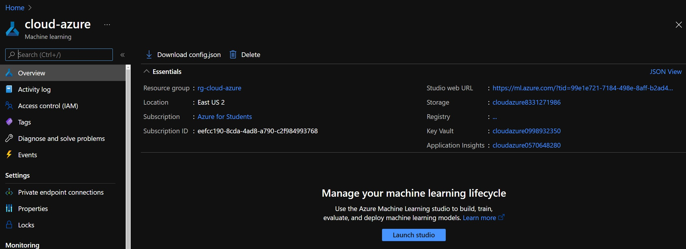
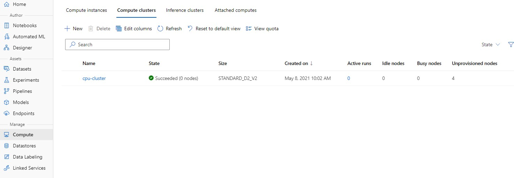
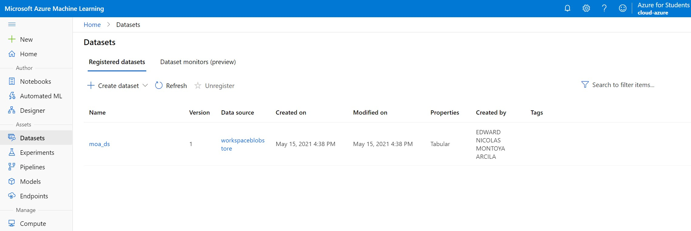
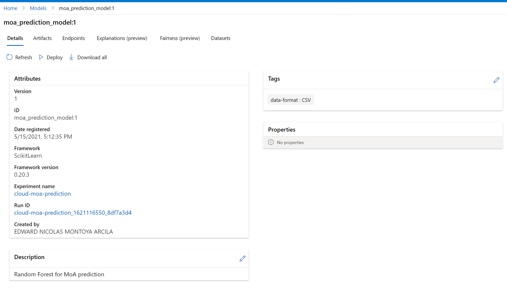
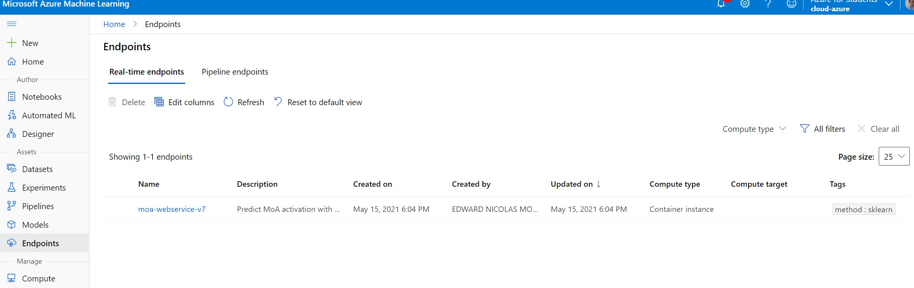

## Cloud - Especialización en analítica y ciencia de datos.

Presentado por: Edward Nicolas Montoya Arcila - Yeison Villamil

### MoA (mechanism of action) PREDICTION

El ejercicio actual consiste en la predicción de los mecanismos de las células, llamada a MoA. A la hora de probar la efectividad de un fármaco, en platos de ensayos son puestas células con RNA único, al ser estimuladas con un fámarco, esta tiene una respuesta que se le llama mecanismo de acción, este funciona activando una proteína. Si el fármaco activa una proteína, quiere decir que este puede ser efectivo para una patología que tengan relacionada esta proteína. El objetivo de este proyecto es desplegar un servicio web en la nube pública de azure mediante AzureML. Este servicio es capaz de predecir si la proteína que se está prediciendo reacciona de forma positiva con un valor de 1 al activarse usando un fármaco o no activarse. https://www.kaggle.com/c/lish-moa

## Descripción de los datos

sig_id : Nombre de los fármacos
cp_type : tipo de control durante el proceso de experimentación
cp_time : tiempo de dosis (24, 48, 72)
cp_dose : tipo de dosis (D1: baja, D2: alta)
g = Estos son los datos de expresiones génicas correspientes a las respuestas al uso de proteínas (872 variables "g")
c = Viabilidad celular correspondiente a los ensayos de laboratorio (100 variables "c")
nfkb_inhibitor: Proteína usada como variable de salida la cual contiene un resultado binario. 1 para activación y 0 para no activación.

Es importante mencionar que muchas proteínas son activadas. Sin embargo para este despliegue se usa una sola proteína.

## Requerimientos

- Subscripción de Azure.
- Docker, solo para ambiente local, recomendado para procesos de debug.
- Conda y Python 3.8 - ``` conda create -n azure-deploy python=3.8 ```
- IDE vs code o equivalente.

## ¿Cómo ejecutarlo?

- Crear un nuevo ambiente de conda.
- Instalar las siguientes dependencias

```bash
pip install azureml-core
pip install azureml
pip install azureml-contrib-services
pip install numpy
pip install pandas
pip install scikit-learn
pip install scikit-multilearn
```

- Ejecutar el primer script de creación del ambiente 

```bash
python ./01-create-environment.py
```

- Seguir los pasos de autenticación interactiva y esperar a que el script nos aprovisione con un entorno de machine learning. Al finalizar dentro de una carpeta llamada .azureml debe existir un archivo configuración con los parámetros del equipo.

NOTA: Si se quiere es posible usar azure cli para no tener que gestionar la autenticación desde el archivo local de configuración.

- La configuración despues del primer script debe generar los siguientes recursos dentro del grupo: Azure Machine Learning, Container registry, Application Insights, Key Vault, Storage Account.



- Ejecutar el segundo script para aprovisionar el entorno de Machine Learning con un cluster para gestionar la computación. Una vez finalice el script debe aparecer en la pestaña de computo del panel general de machine learning un nuevo cluster con el nombre: cpu-cluster



- Ejecutar el tercer script despues de validar que los datos a cargar se encuentren en la carpeta data.



- Ejecutar el cuarto script para entrenar el modelo, los parámetros disponibles son:

  - solver = Indica el parámetro solver para la Regresión Logistica.
  - random_state = Indica el estado de aleatoriedad con el cual inicia la regresión logistica.




- Ejecutar el quinto script con los datos del modelo a desplegar.

  - model_name = Nombre del modelo en AzureML.
  - model_version = Versión del modelo en AzureML.

